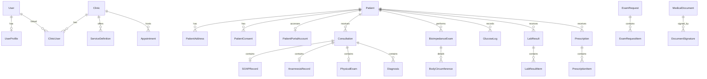

# Data Model - EndocrinoPront Pro

## ER Diagram (Mermaid)

## Decisões de design
- Multi-tenant por coluna `tenantId` em **todas** as entidades.
- Chave primária UUID (`gen_random_uuid()`) para segurança e integração distribuída.
- Soft delete (`deletedAt`) em entidades de negócio para retenção legal.
- JSONB para estruturas flexíveis (template editor, bioimpedância segmentar, conteúdo clínico).
- Versionamento de consulta com `versionGroupId` + `versionNumber`.
- `AuditLog` imutável (insert-only) e separado de `AccessLog` (acesso) e `DataExportLog` (portabilidade LGPD).
- Compatível com Supabase (RLS + extensões `pgcrypto` e `pg_trgm`).
